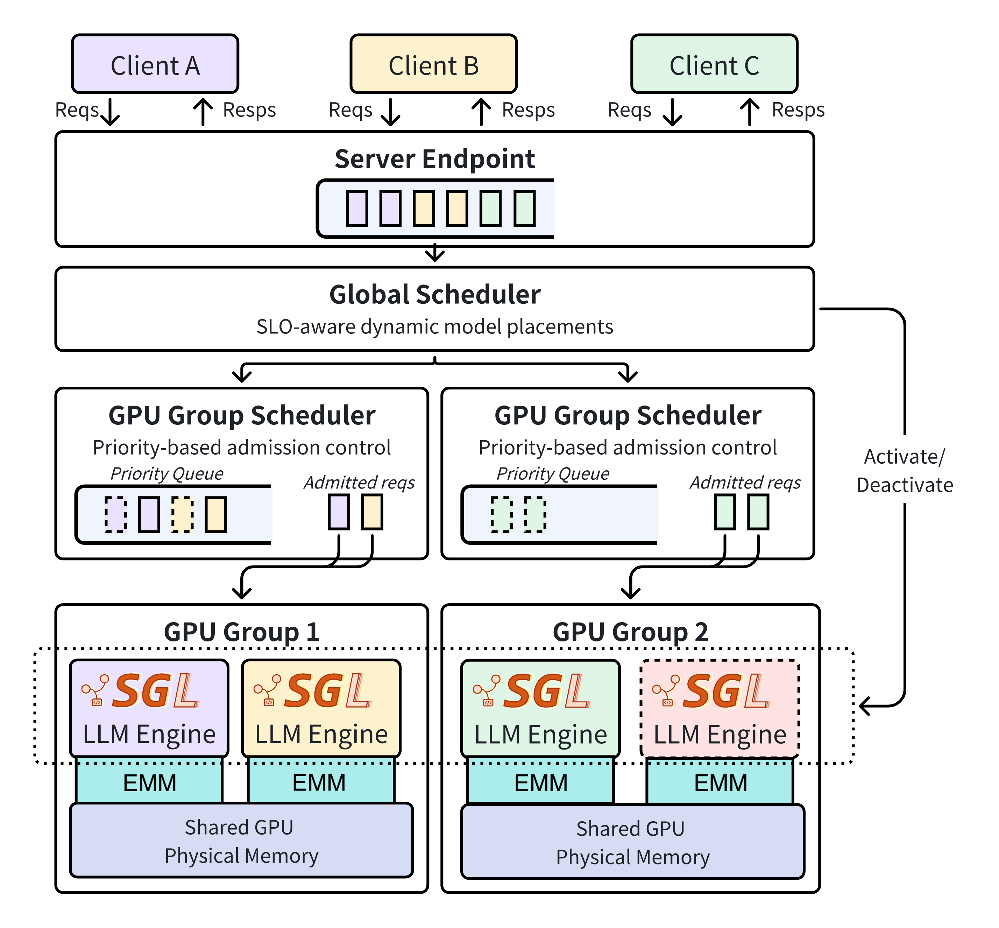

<h1 align="center">Cost-Efficient Multi-LLM Inference</h1>

<p align="center">
  <a href="#about"><b>About</b></a> |
  <a href="#core-innovations"><b>Core Innovations</b></a> |
  <a href="#architecture"><b>Architecture</b></a> |
  <a href="#project-structure"><b>Project Structure</b></a> |
  <a href="#installation"><b>Installation</b></a> |
  <a href="#examples"><b>Examples</b></a> |
</p>

**🚀 chimera is a multi-LLM serving system that achieves >2× cost savings and 3.3× more SLO attainment through flexible GPU sharing.**

## About

Serving multiple large language models (LLMs) raises cost and performance challenges. Today's systems usually dedicate one or a group of GPUs to a specific model, leading to low GPU utilization.


chimera tackles this challenge through flexible GPU sharing, enabling multiple models to share one or more GPUs via time-sharing or space-sharing. To meet latency service-level objectives (SLOs), it employs a scheduling algorithm that dynamically adjusts the sharing policy based on runtime workload patterns. Compared to existing systems, chimera delivers over 2× cost savings and a 3.3× improvement in SLO attainment.


chimera implements its system on top of [SGLang](https://github.com/sgl-project/sglang).


### Core Innovations

chimera introduces two fundamental innovations:

**🔧 Flexible Cross-Model Memory Coordination**
- **On-demand memory allocation**: We decouple virtual and physical GPU memory allocation, enabling dynamic memory redistribution across models without engine modifications.
- **Fast model activation**: chimera supports warm-start through pre-initialized SGLang engines. It also supports parallel model weight loading. Together, this reduces the model activation time (tested 1B to 70B) to <1.5s.

**📊 Two-Level Demand-Aware Scheduling**
- **Global scheduler**: Smart model placement across GPUs to balance the load for better performance.
- **Local scheduler**: Coordinates memory allocation among colocated models using priority-based admission control.


## Architecture

chimera enhances SGLang with flexible GPU sharing capabilities through a unified multi-component architecture:



## Project Structure

chimera extends SGLang with comprehensive multi-model serving capabilities. The key modifications include:

<details>
<summary><b> Multi-LLM Serving with Two-Level Workload-aware Scheduling </b></summary>

```text
python/sglang/
├── launch_multi_model_server.py    # Main entry point for multi-model server
└── multi_model/                    # Complete multi-model serving implementation
    ├── scheduling/
    │   ├── policy/                  # Global scheduling algorithms
    │   ├── gpu/                     # GPU scheduling & resource monitoring
    │   └── ...                      # Additional scheduling components
    ├── endpoint.py                  # Multi-model API endpoints
    ├── engine.py                    # Multi-model engine coordination
    ├── model_service.py             # Model lifecycle management
    ├── multi_model_server.py        # Core server implementation
    ├── request_handler.py           # Request routing and processing
    └── ...                          # Additional server infrastructure
```

</details>

<details>
<summary><b> Enhanced SGLang Runtime with Elastic LLM Engine </b></summary>

```text
python/sglang/srt/
├── managers/
│   ├── scheduler.py                 # 🔧 Enhanced with multi-model scheduling
│   └── ...                          # Other enhanced managers
├── model_executor/                  # 🔧 Worker pool & execution enhancements
├── mem_cache/                       # 🔧 Memory pool & elastic allocation
├── server_args.py                   # 🔧 Multi-model server arguments
└── ...                              # Additional runtime modifications
```

</details>

<details>
<summary><b> Benchmarking & Evaluation </b></summary>

```text
benchmark/multi-model/
├── benchmark.py                     # Multi-model workload benchmarking
├── trace.py                         # Synthetic & real-world trace generation
├── model_configs/                    # Various model configuration setups
└── ...                              # Additional benchmarking tools & code
```
</details>

## Installation

For detailed installation instructions and benchmarking setup, please refer to [install.md](install.md).

## Examples

chimera offers three deployment modes, each building upon the previous with enhanced capabilities:

<details>
<summary><b> Colocate LLMs with Static Memory Allocation</b></summary>

Launch server with static memory allocation:

```bash
# Navigate to benchmark directory
cd benchmark/multi-model

# Start server with static configuration
python3 -m sglang.launch_multi_model_server \
  --model-config-file ./model_configs/1_gpu_2_model_colocate_static.json \
  --host 127.0.0.1 \
  --port 30000 \
  --disable-cuda-graph \
  --disable-radix-cache \
  --load-format dummy \
  --log-file server-logs/static.log
```

**Run synthetic trace benchmark:**

```bash
python3 benchmark.py \
  --base-url http://127.0.0.1:30000 \
  --num-models 2 \
  --model-paths model_1 model_2 \
  --exp-name static_baseline \
  --req-rate 10 \
  --seed 42
```

</details>

<details>
<summary><b> Colocate LLMs with Elastic Memory Allocation</b></summary>

Launch server with chimera's elastic memory management:

```bash
# Start server with elastic emm
python3 -m sglang.launch_multi_model_server \
  --model-config-file ./model_configs/1_gpu_2_model_colocate_elastic.json \
  --host 127.0.0.1 \
  --port 30001 \
  --disable-cuda-graph \
  --disable-radix-cache \
  --enable-elastic-memory \
  --use-emm-v0 \
  --log-file server-logs/elastic.log
```

**Run with model switching:**

```bash
python3 benchmark.py \
  --base-url http://127.0.0.1:30001 \
  --num-models 2 \
  --model-paths model_1 model_2 \
  --exp-name elastic_memory \
  --enable-elastic-memory \
  --req-rate 10 \
  --seed 42
```

</details>

<details>
<summary><b> Flexible Time and Space Sharing (Full chimera)</b></summary>

Launch server with complete chimera system:

```bash
# Start server with full chimera capabilities
python3 -m sglang.launch_multi_model_server \
  --model-config-file ./model_configs/8_gpu_18_model_our.json \
  --port 30002 \
  --disable-cuda-graph \
  --disable-radix-cache \
  --enable-cpu-share-memory
  --enable-elastic-memory \
  --use-emm-v0 \
  --max-mem-usage 67.28 \
  --enable-gpu-scheduler \
  --enable-controller \
  --policy simple-global \
  --enable-model-service \
  --enable-worker-pool \
  --workers-per-gpu 4 \
  --num-model-service-workers 4 \
  --num-gpus 8 \
  --log-file server-logs/workerpool.log
```

**Run large-scale benchmark:**

```bash
python3 benchmark.py \
  --base-url http://127.0.0.1:30002 \
  --num-models 18 \
  --num-gpus 8 \
  --exp-name chimera_full \
  --e2e-benchmark \
  --real-trace ./real_trace.pkl \
  --time-scale 1 \
  --replication 1
```

</details>

### Configuration Guide

<details>
<summary><b> Model placement configuration </b></summary>

chimera launches LLMs based on an initial placement file. The placement file is a JSON file that specifies the model name, model path, and the GPU IDs on which the model should be placed.

Below are some examples of the initial model placements.

**Colocate two models on GPU 0:**
```json
[
  {
    "model_name": "model_1",
    "model_path": "meta-llama/Llama-3.2-1B",
    "tp_size": 1,
    "init_placements": [{
      "gpu_ids": [0],
      "on": true,
      "max_memory_pool_size": 15
    }]
  },
  {
    "model_name": "model_2", 
    "model_path": "meta-llama/Llama-3.2-3B",
    "tp_size": 1,
    "init_placements": [{
      "gpu_ids": [0],
      "on": false,
      "max_memory_pool_size": 15
    }]
  }
]
```

**Load 70B model across 4 GPUs:**
```json
[
  {
    "model_name": "large_model",
    "model_path": "meta-llama/Llama-3.3-70B-Instruct", 
    "tp_size": 4,
    "init_placements": [{
      "gpu_ids": [0, 1, 2, 3],
      "on": true,
      "max_memory_pool_size": 10
    }]
  }
]
```

For more configuration examples, see [`benchmark/multi-model/model_configs/`](benchmark/multi-model/model_configs/).

</details>

---

<p align="center">
  <a href="#chimeratop" target="_blank">
  <bold>Back To Top </bold>
  </a>
</p>